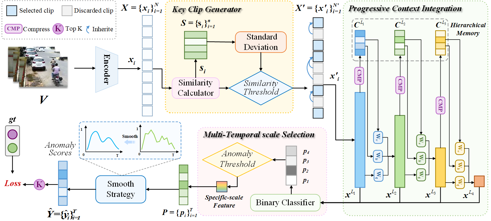

# StreamVAD
This is the official repository of our paper:
**"StreamVAD: A Streaming Framework with Progressive Context Integration for Multi-Temporal Scale Video Anomaly Detection"** 


## Highlight
- An lightweight streaming video anomaly detection framework is proposed.

- A streaming progressive context integration captures long-term dependencies online.

- A streaming key clip generator reduces redundancy while preserving semantic content.

- A multi-temporal scale selection dynamically adjusts scale and reduces computation.

- The method detects long-term anomalies effectively while maintaining low latency.
## Dataset
We use extracted CLIP features for UCF-Crime and XD-Violence datasets by [VadCLIP](https://github.com/nwpu-zxr/VadCLIP).  The features can be downloaded at [VadCLIP](https://github.com/nwpu-zxr/VadCLIP).

Our long-term video dataset can be downloaded at [OneDrive](https://1drv.ms/f/c/9da13db395f6b4bb/Ev6CnA2zRvhHgk1bA8fxUA0Bq8IV6iRfvbxhI8apFIuGJA?e=d4fQZS)
We also extracted CLIP features, the feature file can be loaded at [OneDrive](https://1drv.ms/f/c/9da13db395f6b4bb/EiBE_sp-rXRElPQOhKkpKjYBxllv5JWAWhvx0wT1Pvux8g?e=ldvOm1)

## Setup
To execute the code on your local setup, you will need to make the following adjustments to the files:
Update the file paths in `list/xd_CLIP_rgb.csv` `list/ucf_CLIP_rgb.csv` and `list/xd_CLIP_rgbtest.csv`  `list/ucf_CLIP_rgbtest.csv` to point to the locations where you have downloaded the datasets.
You have the flexibility to modify the hyperparameters as per your requirements in the file `xd_option.py` and `ucf_option.py`.
The model can be donwload at [OneDrive](https://1drv.ms/f/c/9da13db395f6b4bb/EpbIdDx81stMnKsmtJuah_EBl7Ic6amf4YrOXKdYVf97ig?e=TcxMct)
## Training

Traing for XD-Violence dataset
```
python xd_train.py
```
Traing for UCF-Crime dataset
```
python ucf_train.py
```

## Testing

testing for XD-Violence dataset
```
python xd_test.py
```
testing for UCF-Crime dataset
```
python ucf_test.py
```
testing for long term dataset, Modify `test_list` path and `gt` path, run 
```
python longterm_test.py
```

## References
We referenced the repos below for the code. We thank them for their wonderful work！
* [MeMViT](https://github.com/facebookresearch/MeMViT)
* [VadCLIP](https://github.com/nwpu-zxr/VadCLIP)

## Citation
```bibtex
@article{HAN2025131669,
title = {StreamVAD: A streaming framework with progressive context integration for multi-temporal scale video anomaly detection},
journal = {Neurocomputing},
volume = {658},
pages = {131669},
year = {2025},
issn = {0925-2312},
doi = {https://doi.org/10.1016/j.neucom.2025.131669},
url = {https://www.sciencedirect.com/science/article/pii/S0925231225023410},
author = {Lijun Han and Gang Liang and Pengcheng Wang and Dingming Liu and Kui Zhao},
keywords = {Anomaly detection, Streaming framework, Weakly supervised learning, Hierarchical memory, Multiscale behavioral analysis},
abstract = {Video anomaly detection (VAD) plays a crucial role in intelligent surveillance systems by identifying abnormal events in video streams. However, most existing methods either rely on isolated feature extraction—failing to model inter-action contextual relationships critical for complex anomaly recognition—or demand full-video processing via graph/hierarchical architectures, which incur high latency, computational burden, and parameter/memory inefficiency with depth. Lightweight designs mitigate costs but sacrifice temporal sensitivity through shallow networks and short-clip inputs, limiting detection of subtle or multi-scale anomalies in streaming scenarios. To address these challenges, we propose StreamVAD, a lightweight streaming anomaly detection framework that achieves low-latency, long-term temporal modeling with minimal computational overhead. A Key Clip Generator (KCG) filters redundant inputs in a streaming manner, allowing the model to focus on informative content while reducing computational cost. A progressive context integration (PCI) module incrementally expands the temporal receptive field by integrating historical context without full-sequence buffering, enabling efficient detection of complex long-term anomalies. Additionally, a multi-scale temporal selection (MTS) strategy dynamically adapts temporal resolution to capture both short- and long-term abnormalities. Extensive experiments on UCF-Crime, XD-Violence, and a supplemental long-term anomaly dataset demonstrate that StreamVAD achieves effective video anomaly detection with fewer parameters and lower latency. The code and dataset are available at https://github.com/Han-lijun/StreamVAD.}
}

```
---
